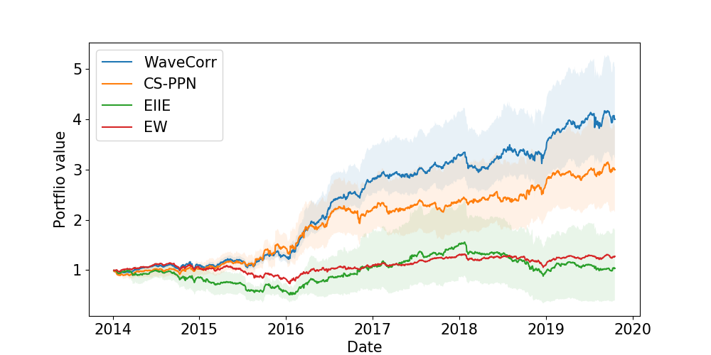
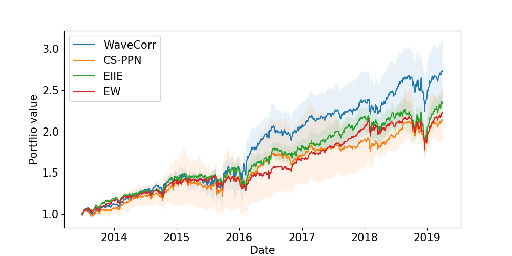
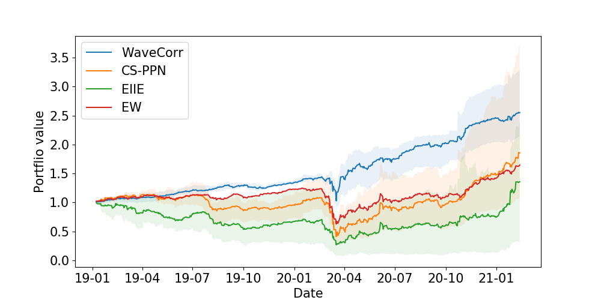
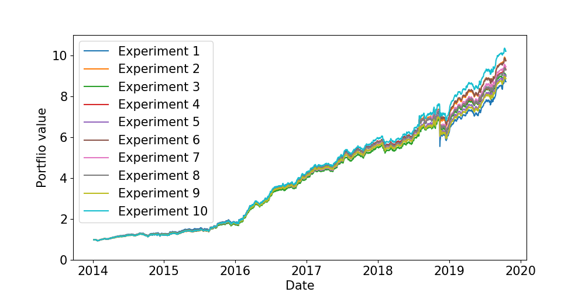
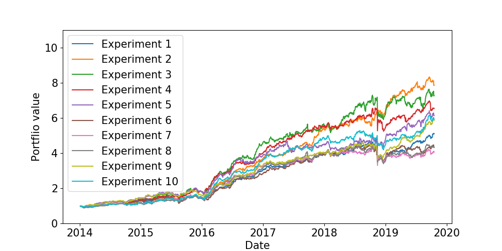

# waveCorr
This is the source code of the paper entitled "WaveCorr: Correlation-savvy Deep Reinforcement Learning for Portfolio Management".

# Running the project
wavecorr_run.py is the main file to run the project. 
Specify the parameters and hyper-parameters if the model and run the project.

# Network architecture
The architecture of the network is based on waveNet as follows:

# Comparing with benchmarks- with transaction costs

# Comparing with benchmarks- Permutation

